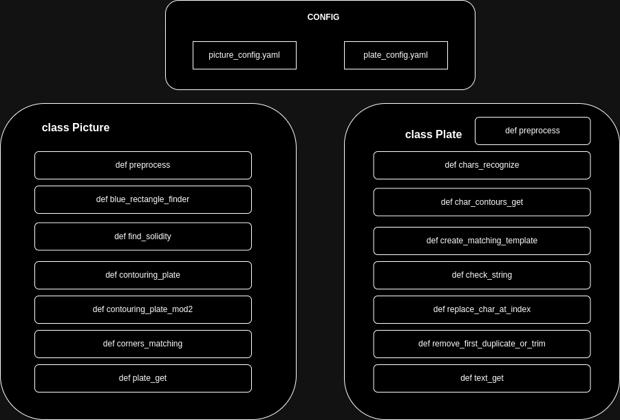
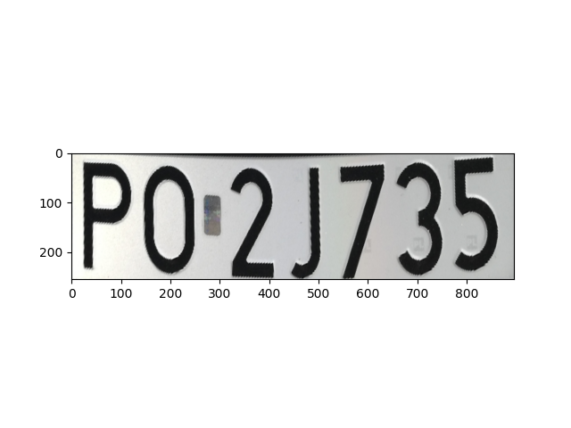

# car_number_plates_recognizer


## Table of Contents
- [Main goal](#main-goal)
- [Installation](#installation)
- [Usage](#usage)
- [Configuration](#configuration)
- [Results](#results)
- [Documentation](#documentation)
- [Bugs & Feature Requests](#bugs--feature-requests)

## Main Goal

The project involves developing a vision system for detecting and reading car license plates.

**Assumptions:**
- The license plates come from Poland
- The boards in the photos will slant no more than ± 45 degrees from the horizontal position,
- The longer edge of the plate occupies more than one-third of the width of the photo,
- The angle between the optical axis of the camera and the plane of the plate not more than 45 degrees,
- Ordinary boards are photographed - with black characters on a white background (7 or 8 characters),
- Photos may have different resolution.


## Installation

**Clone** repository and go into folder:
```bash
git clone https://github.com/2acholsk1/car_license_plates_recognizer.git
cd car_license_plates_recognizer
```

After that, you need to setup virtual environment, Makefile commands will help you:
```bash
make setup-venv
```
Remember to activate venv with command: `source bin/activate`.

Then, you can easily build and install package by using:
```bash
make setup
```

## Usage

To **run** program you need use command `Recognize_Plates` to specify folder path from which photos will be taken and give path to save results in `.json` file.
```bash
Recognize_Plates folder/with/photos path/to/save/results
```

## Configuration

There are two configuration files: picture_config.yaml and plate_config.yaml. The first file contains parameters for **sizing the plate** image output and **HSV values** for white and blue color masking. In the second file, the parameters for **character sizing** have been set.


## Results

Example output of recognized text from license plates in `.json` file:
```json
{
  "PZ0460J.jpg": "PZ04601",
  "PO033AX.jpg": "PO033AX",
  "PO522WJ.jpg": "PO522WJ",
  "WSCUP62.jpg": "WSCUP62",
  "POBTC81.jpg": "POBTC81",
  "PO2J735.jpg": "PO2J735",
  "PO2W494.jpg": "PO2V4494",
  "PGN756EC.jpg": "PGN756C",
  "PKL8C63.jpg": "PKL8C63",
  "PO778SS.jpg": "PO778SS",
  "PO6K534.jpg": "PO6K534",
  "PO155KU.jpg": "PO155KU",
  "CIN20356.jpg": "CN20356",
  "PCT15PY.jpg": "PCT15PY",
  "PO5T224.jpg": "PO5T224",
  "PKRR788.jpg": "PKRR788",
  "PGN141GR.jpg": "PGN141GR",
  "FSD23429.jpg": "SD23429",
  "ZSL17729.jpg": "ZSL6069",
  "PSZ47620.jpg": "PSZ47620",
  "PKS30W3.jpg": "POZ2137",
  "CMG21FG.jpg": "CMG21FG",
  "PSE22800.jpg": "PSE22800",
  "POZS221.jpg": "POZS221",
  "PO096NT.jpg": "PO096N8",
  "PZ492AK.jpg": "PZ492AK"
}
```

## Documentation

### Description

The project consists of two main classes Picture and Plate, which together are used to process images and recognize characters on license plates. The Picture class is responsible for pre-processing images and extracting license plates, while the Plate class handles character recognition on the extracted license plates.



### Code workflow

**1. Initialization of object class Picture.**
- Load image from given path
- Scale the image to the specified width size_init while maintaining the aspect ratio.


**2. Preprocessing of the image (preprocessing method in the Picture class, OPTIONAL).**
- Optional launch of developer mode with sliders to adjust processing parameters.
- Image filtering using various techniques (GaussianBlur, bilateralFilter).
- Edge detection using the Canny algorithm.
- Optional morphological operations (erosion, dilation, opening, closing).


**3. Searching for a blue rectangle (blue_rectangle_finder method in the Picture class).**
- Convert the image to HSV color space.
- Creating a mask based on the blue color range.
- Searching for contours and sorting them by area.
- Returning the coordinates of the upper left corner of the largest blue rectangle.


**4. Contouring the license plate (contouring_plate method in the Picture class).**
- Searching for a blue rectangle.
- Converting the image to HSV color space and creating a mask based on the white color range.
- Searching and sorting contours by area.
- Checking the solidity of contours and their shape (four-sidedness).


- Perspective transformation of the license plate.



**5. Initialization of the Plate class object.**
- Adding a white border around the plate image.
- Verifying the correctness of the plate image.

**6. Preprocessing of the license plate (preproccess method in the Plate class, OPTIONAL)**
- Optional launch of developer mode with sliders to adjust processing parameters.
- Image filtering using various techniques (GaussianBlur, bilateralFilter).
- Edge detection using the Canny algorithm and morphological operations.
- Drawing contours on the image.

**7. Recognition of the characters on the license plate (chars_recognize method in the Plate class).**
- Conversion of plate image to grayscale and bilateral filtering.
- Adaptive thresholding and contour search.
- Character contour extraction.
- Comparing character outlines with character templates stored in a font folder.
- Assembling recognized characters into text.


**8. Additional auxiliary operations (check_string, replace_char_at_index methods in the Plate class).**
- Checking and correcting the recognized text on the plate.
- Replacing some characters with more likely equivalents depending on their position in the text.
- Generating random digits to fill in missing characters if the text length is less than 7 characters.

## Bugs & Feature Requests

Please report bugs and request features using the [Issue Tracker](https://github.com/2acholsk1/car_license_plates_recognizer/issues).
